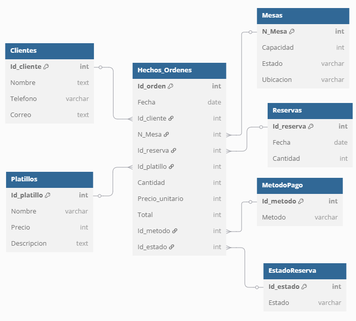

# Analisis de restaurante "El Campesino"

## Se han utilizado datos dummy por cuestiones de tiempo

## 1. Como funciona?
 El programa (`analisis.py`) se encarga generar gráficos para las siguientes preguntas de un año especifico:

 * ¿Cuáles fueron los platillos más pedidos en un año específico?
 * ¿Qué días hay mayor demanda?
 * ¿Cuánto se vende al mes?
 * ¿Cuántas personas en promedio hay por reserva?
 * ¿Cuántos ingresos hay por metodo de pago utilizado?
 * ¿Cuántos ingresos generan los platillos pedidos anualmente?

Los gráficos resultantes son almacenados en la carpeta (`Gráficos_Resultados`),que es generada en caso de no existir, en formato png.

## 2. Prerrequsitos del programa:

Antes de ejecutar este programa, asegúrate de tener instalado lo siguiente:

### Postgresql (con el servidor instalado y corriendo)

- Si no lo tienes puedes seguir los pasos de [postgresql.org](https://www.postgresql.org/download/)
 
### Entorno de Python

- Python 3.8 o superior  
Puedes descargarlo desde [python.org](https://www.python.org/).

### Librerías necesarias

- Pandas
- Matplotlib
- Psycopg2
- Python-dotenv

Instálalas usando `pip` si estas usando un entorno de windows:

```bash
pip install pandas matplotlib python-dotenv psycopg2-binary
```

Si no, puedes usar:

```bash
pip install pandas matplotlib python-dotenv psycopg2
```

## 3. Preparar la Base de Datos

### 3.1 Iniciar y crear BD postgresql

Con postgresql instalado y en tu entorno a eleccion, ejecuta los siguientes comandos:

```bash
sudo service postgresql start
sudo -u postgres psql
```

En la terminal de postgresql, borra y cambia los parametros entre <> a tu eleccion:

```bash
CREATE USER <nombre_usuario> WITH PASSWORD <'contraseña_segura'>;
CREATE DATABASE <mibasededatos> OWNER <nombre_usuario>;
```
### Ejemplo

```bash
CREATE USER admin WITH PASSWORD 12345;
CREATE DATABASE restaurante OWNER admin;
```

### 3.2 Clona el repositorio usando `git`:

```bash
git clone https://github.com/MaxArayaE/Araya-Toledo-Grupo9-INFO133.git
cd Araya-Toledo-Grupo9-INFO133
```

### 3.3 Editar credenciales:

Clona el archivo `.env_credenciales` y nombralo `.env`, en él modifica a tus datos con los que creaste la base de datos, para acceder a ella con el programa:

* DB_HOST="localhost"
* DB_PORT="5432"
* DB_NAME="midb"
* DB_USER="miusuario"
* DB_PASSWORD="miclave"

### 3.4 Ejecuta rellenar.py

Este script rellena los datos en la base de datos, abre una terminal en la carpeta clonada del repositorio, verifica que estas en el directiorio:

 * "....\INFO133 Restaurantes\Araya-Toledo-Grupo9-INFO133>" 

Ejecuta el `rellenar.py` en la terminal:

```bash
python rellenar.py
```

## 4 Ejecutar el analisis

En la terminal del directorio del repositorio clonado ejecuta `analisis.py` con el año 2024 o 2025:

```bash
python analisis.py 2024
```

En la carpeta `Gráficos_Resultados` con su respectivo año, encontraras los gráficos en formato png de las consultas mencionadas en el punto 1.

## Diagrama de la Base de Datos:




