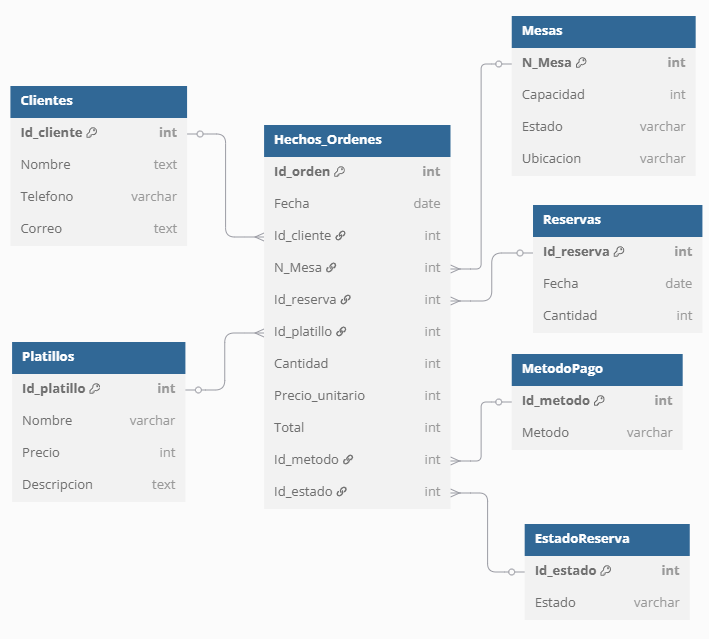
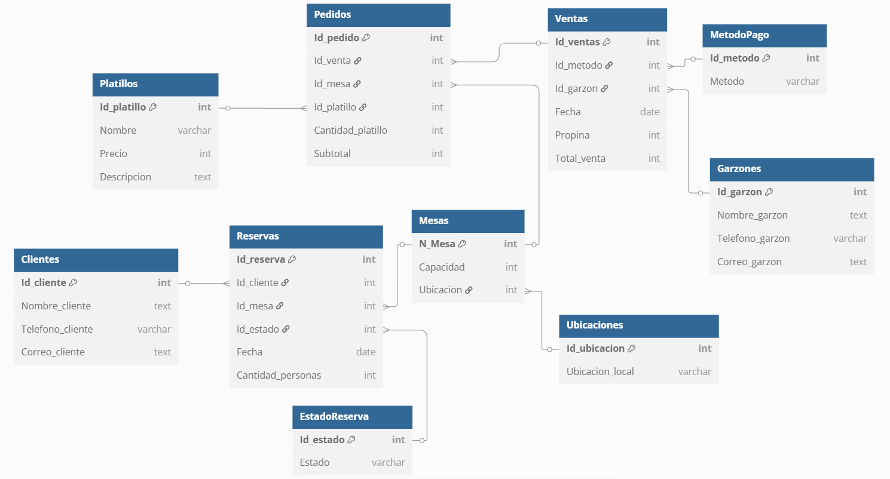

# Analisis de restaurante "El Campesino"

## Se han utilizado datos dummy por cuestiones de tiempo

## 1. Como funciona?
Se útiliza en el Siguiente Orden:
* **1). BD_Transaccional:**
Al ejecutar el SCRIPT (`menu_app.py`) obtendremos acceso a un menú CRUD operado en terminal con el cual generaremos y operaremos datos en una BD Transaccional.
* **2). BD_ETL:**
Ejecutando el SCRIPT (`etl_restaurante.py`) pasaremos los datos generados en el paso 1 hacia el formato de la bd aplicada en BD_Analisis y se añadiran dichos datos a dicha bd (en caso de que ya exista la bd, este script la elimina y crea de nuevo).
* **3). BD_Analisis:**
Finalmente habiendo realizado los pasos anteriores, podemos utilizar el script (`analisis.py`) con un año adjunto, con el cual se generaran gráficos de analisis de la información del año especificado respondiendo a las preguntas:

  * ¿Cuáles fueron los platillos más pedidos en un año específico?
  * ¿Qué días hay mayor demanda?
  * ¿Cuánto se vende al mes?
  * ¿Cuántas personas en promedio hay por reserva?
  * ¿Cuántos ingresos hay por metodo de pago utilizado?
  * ¿Cuántos ingresos generan los platillos pedidos anualmente?

 Los gráficos resultantes son almacenados en la carpeta (`Gráficos_Resultados`),que es generada en caso de no existir, en formato png.

## 2. Prerrequsitos del programa:

Antes de ejecutar este programa, asegúrate de tener instalado lo siguiente:

### Postgresql (con el servidor instalado y corriendo)

- Si no lo tienes puedes seguir los pasos de [postgresql.org](https://www.postgresql.org/download/)
 
### Entorno de Python

- Python 3.8 o superior  
Puedes descargarlo desde [python.org](https://www.python.org/).

### Librerías necesarias

- Pandas
- Matplotlib
- Psycopg2
- Python-dotenv
- tabulate

Instálalas usando `pip` si estas usando un entorno de windows:

```bash
pip install pandas matplotlib tabulate python-dotenv psycopg2-binary
```

Si no, puedes usar:

```bash
pip install pandas matplotlib tabulate python-dotenv psycopg2
```

## 3. Preparar la Base de Datos

### 3.1 Iniciar y crear BD postgresql

Con postgresql instalado y en tu entorno a eleccion, ejecuta los siguientes comandos:

```bash
sudo service postgresql start
sudo -u postgres psql
```

En la terminal de postgresql, borra y cambia los parametros entre <> a tu eleccion, hazlo dos veces ya que necesitamos una para Transacciones y otra para Analisis:

```bash
CREATE USER <nombre_usuario> WITH PASSWORD <'contraseña_segura'>;
CREATE DATABASE <mibasededatos> OWNER <nombre_usuario>;
```
### Ejemplo

```bash
CREATE USER admin WITH PASSWORD 12345;
CREATE DATABASE transacciones OWNER admin;
CREATE DATABASE analisis OWNER admin;
```

### 3.2 Clona el repositorio usando `git`:

```bash
git clone https://github.com/MaxArayaE/Araya-Toledo-Grupo9-INFO133.git
cd Araya-Toledo-Grupo9-INFO133
```

### 3.3 Editar credenciales:

Clona el archivo `.env_credenciales` en la misma carpeta y nombralo `.env`, en él modifica a tus datos con los que creaste la base de datos, para acceder a ella con el programa:

* DB_HOST="localhost"
* DB_PORT="5432"
* DB_NAME_TARGET="midb1" (cambia el nombre a tu BD de Transacciones)
* DB_NAME_SOURCE="midb2" (cambia el nombre a tu BD de Analisis)
* DB_USER="miusuario"
* DB_PASSWORD="miclave"

## 4 Ejecuta el script `menu_app.py`:

En la terminal del directorio del repositorio clonado ejecuta `menu_app.py`:

```bash
python .\BD_Transaccional\menu_app.py
```
Tienes que utilizar el menu en la terminal, Primero deberas ingresar la opción 9 para generar los datos en la BD y así tendras acceso a todas las opciones del Menú CRUD.

## 5 Ejecuta el script `etl_restaurante.py`

En la terminal del directorio del repositorio clonado ejecuta `etl_restaurante.py`:

```bash
python .\BD_ETL\etl_restaurante.py
```
Este script, toma los datos que generamos en el menú CRUD, los vuelve al formato de la base de datos de analisis y los inserta en esta.

## 6 Ejecutar el script `analisis.py`

En la terminal del directorio del repositorio clonado ejecuta `analisis.py` con el año 2022, 2023 o 2024:

```bash
python analisis.py 2024
```

En la carpeta `Gráficos_Resultados` con su respectivo año, encontraras los gráficos en formato png de las consultas mencionadas en el punto 1.

## Diagrama de la Base de Datos de Analisis:



## Diagrama de la Base de Datos Transaccional:




